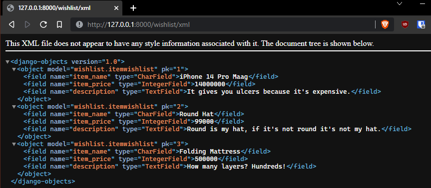
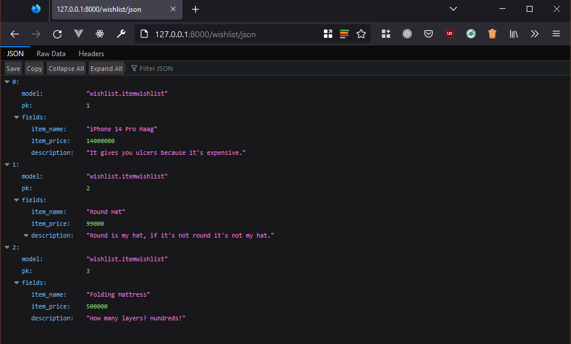

# Lab 2: Data Delivery

Platform-Based Programming (CSGE602022) - Organized by the Faculty of Computer Science Universitas Indonesia, Odd Semester 2022/2023

---

## Learning Objectives

After completing this tutorial, you will be able to:

-  Understand XML and JSON as data delivery format
-  Serialize (or, convert) a Python object into XML or JSON string
-  Retrieve one or more data objects from a persistent data source
-  Implement a function that returns an HTTP response containing XML or JSON
   string

## Introduction to Data Delivery

When developing on a platform, there's a time when we need to send the data from one stack to another. The delivered data can be sent in various forms. Some examples of commonly used data formats are HTML, XML, and JSON. You've learned the data delivery implementation in HTML form in the previous tutorial. In this tutorial, you'll learn about XML and JSON.

## XML (Extensible Markup Language)

XML stands for Extensible Markup Language. XML designed as _self-descriptive_, so by reading the XML file we can understand what's information we want to convey from the written data. XML is used a lot for web and mobile applications to save and send data. XML is just information wrapped in a tag. We need to write a program to send, receive, save, and display that information.

```xml
<?xml version="1.0" encoding="UTF-8"?>
<phone>
  <brand>Apple</brand>
  <type>iPhone 14 plus</type>
  <color>Red</color>
  <memory>256</memory>
</phone>
```

The XML text above is _self-descriptive_. It means that every attributes that
describe a phone are described in the data itself. You can infer that the XML
contains information about a red-colored iPhone 14 Plus made by Apple.

XML Document create a structure like _tree_ that started from _root_, then branch, and ends at the leaves. The XML document need to contain a _root_ element that's the parent for other elements. In the example above, `<phone>` is a _root_ element.

For the line `<?xml version="1.0" encoding="UTF-8"?>` it's commonly referred as **XML Prolog**. XML prolog is optional, but if it exists, it must be at the beginning of the document. In XML documents, all elements must have a closing tag. XML tag is _case sensitive_, so that `<phone>` tag is different from `<Phone>` tag.

## JSON (JavaScript Object Notation)

JSON stands for JavaScript Object Notation. JSON is designed to be self-describing, so JSON is very easy to understand. JSON is used in many web and mobile applications, namely to store and transmit data. JSON syntax is an instance of JavaScript Object. However, the JSON format is in the form of text, so the code to read and create JSON is found in many programming languages.

Example JSON format:

```json
{
    "brand": "Samsung",
    "type": "S22 Ultra",
    "color": "Black",
    "memory": "256",
}
```

Data in JSON is stored in the form of keys and values. In the example above, the keys are `brand`, `type`, `color`, and `memory`. Value can be a primitive data type (string, number, boolean) or an object.

## Tutorial on Returning Data in XML Form

Notes: **In this tutorial, you will use the project you created in the previous tutorial.**

1. Open `views.py` in `wishlist` app folder and create a function that accepts a request object.
2. Import `HttpResponse` class and `serializers` function:

   ```python title="./wishlist/views.py"
   from django.http import HttpResponse
   from django.core import serializers
   ```
3. Create a variable inside the function that stores the query results of all the data in `ItemWishlist`:

   ```python title="./wishlist/views.py"
   data = ItemWishlist.objects.all()
   ```
4. Add a return function that returns a `HttpResponse` object containing the query result data parameter that has been serialized into XML:

   ```python title="./wishlist/views.py"
   # Note: the first argument to HttpResponse constructor receives the actual data payload,
   #       then the second, keyword argument content_type defines the content_type header in the created HTTP response object.
   #       It tells the receiving party (i.e. the client that expecting a response) that the response contain a XML data.
   return HttpResponse(serializers.serialize("xml", data), content_type="application/xml")
   ```
5. Open `urls.py` in `wishlist` folder and import the function you created earlier.

   ```python title="./wishlist/urls.py"
   from wishlist.views import show_xml # Customize to the name of the function created
   ```
6. Add new URL path to `urlpatterns` so incoming HTTP GET requests to `xml` path is handled by the function you created earlier:

   ```python title="./wishlist/urls.py"
   ...
   path('xml/', show_xml, name='show_xml'), # Customize the name of the function created
   ...
   ```
7. Run your Django project with the `python manage.py runserver` command and open `http://localhost:8000/wishlist/xml/` in your favorite browser to see the result.
   Make sure the URL path matches with the new URL path you defined in `urls.py`.
   The displayed XML data should be similar to the following screenshot:

   

## Tutorial on Returning Data in JSON Form

1. Open `views.py` in `wishlist` app folder and create a new function that
   accepts a request parameter.
2. Create a variable in the function that stores the query results of all the data in `ItemWishlist`:

   ```python title="./wishlist/views.py"
   data = ItemWishlist.objects.all()
   ```
3. Add a return statement that returns an `HttpResponse` object:

   ```python title="./wishlist/views.py"
   return HttpResponse(serializers.serialize("json", data), content_type="application/json")
   ```
4. Open `urls.py` in `wishlist` app folder and import the function you created earlier:

   ```python title="./wishlist/urls.py"
   from wishlist.views import show_json  # Adjust the name of the function created
   ```
5. Add the URL path to `urlpatterns` list to map incoming request with URL `json/` to
   be handled by the new function:

   ```python title="./wishlist/urls.py"
   ...
   path('json/', show_json, name='show_json'),  # Customize the name of the function created
   ...
   ```
6. Run your Django project with the `python manage.py runserver` command and open http://localhost:8000/wishlist/json/ (match the url path created) in your preferred browser to see the results. The displayed JSON should look similar to the following screenshot:

   

## Tutorial on Returning Data in XML/JSON Form Based on ID

1. Open `views.py` in `wishlist` app folder and create a new function that accepts a request and an ID parameter.
2. Create a variable in the function that stores the query results of the data with specific ID in `ItemWishlist`:

   ```python title="./wishlist/views.py"
   data = ItemWishlist.objects.filter(pk=id)
   ```
3. Add a return statement that returns an `HttpResponse` object.
   The response object should contain the result of data serialization (JSON or XML) and the description of the content type that encapsulated in the response.
   For example:

   ```python title="./wishlist/views.py"
   # JSON Format
   return HttpResponse(serializers.serialize("json", data), content_type="application/json")

   # XML Format
   return HttpResponse(serializers.serialize("xml", data), content_type="application/xml")
   ```
4. Open `urls.py` in `wishlist` app folder and import the function you created
   earlier:

   ```python title="./wishlist/urls.py"
   from wishlist.views import show_json_by_id  # Customize the name of the function created
   ```
5. Add a new, parameterized URL path pattern into `urlpatterns` list. A URL
   path pattern may contain a parameter. The parameter is written in format of
   `<T:N>` where `T` is a data type (e.g. `int`, `str`) and `N` is the name of
   parameter. The new URL path pattern should map incoming request toward
   `/json/<some ID>` to the new function that you imported in previous step.
   For example:

   ```python title="./wishlist/urls.py"
   ...
   path('json/<int:id>', show_json_by_id, name=’show_json_by_id’),  # Customize the name of the function created
   ...
   ```
6. Run your Django project with `python manage.py runserver` command and open
   `http://localhost:8000/wishlist/json/<id>` using web browser. `<id>` is the
   ID value of the desired data. If the data with given ID found and processed
   by Django, the response will contain a JSON string and delivered to your web
   browser.
