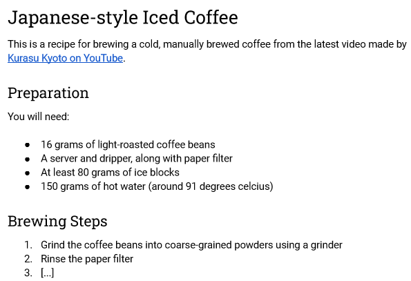

import CodeEditor from "@site/src/components/CodeEditor"
import { headingExample } from "@site/src/data/examples"

# &lt;h1&gt; - Heading

The heading element is a text element used for providing textual heading in a
part of a page. It can defined by using a pair of `<hX>` and `</hX>` tag, where
`X` is a number from 1 to 6. `<h1>` is the biggest heading, while `<h6>` is the
smallest heading.

They (i.e. the heading tags) function similarly to the heading that you often
use when writing document in an office suite such as Microsoft Word or Google
Docs. For example, suppose you want to describe a coffee brewing recipe. You
might write a draft for the recipe in Google Docs similar to the following
screenshot:



The same structure and content can be defined in a HTML page: _(try to copy
the HTML code snippet below into the code editor at the end of the page)_

```html
<html>
  <head>
    <!-- Assume there are some tags within the head -->
  </head>
  <body>
    <h1>Japanese-styled Iced Coffee</h1>
    <p>
      This is a recipe for brewing a cold, manually brewed coffee from the latest video made by <a href="https://www.youtube.com/watch?v=B0twDujnvpc">Kurasu Kyoto on YouTube</a>.
    </p>

    <h2>Preparation</h2>
    <p>You will need:</p>
    <ul>
      <li>16 grams of light-roasted coffee beans</li>
      <li>A server and dripper, along with paper filter</li>
      <li>At least 80 grams of ice blocks</li>
      <li>150 grams of hot water (around 91 degrees celcius)</li>
    </ul>

    <h2>Brewing Steps</h2>
    <ol>
      <li>Grind the coffee beans into coarse-grained powders using a grinder</li>
      <li>Rinse the paper filter</li>
      <li>[...]</li>
    </ol>
  </body>
</html>
```

## Usage Example

<CodeEditor defaultValue={headingExample}  />
